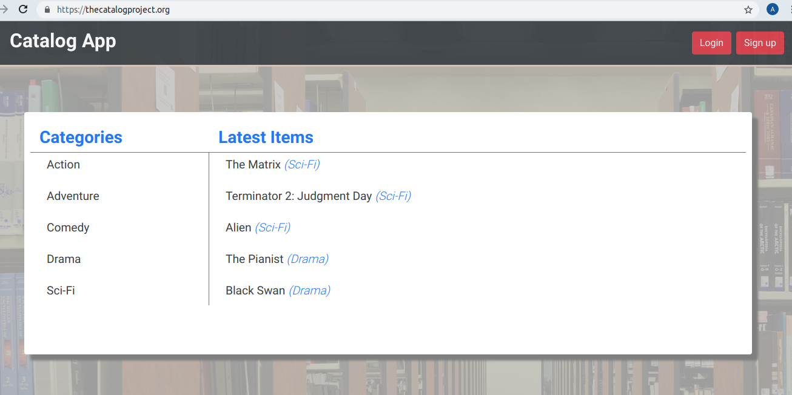
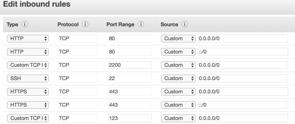

# Deploy a Flask Web application on a linux server



[thecatalogproject.org](https://thecatalogproject.org)
## Table of Contents

+ [Description](#description)
+ [Requirements](#requirements)
+ [Setup](#setup)
  + [Linux Server](#linux-server)
  + [PostgreSQL](#postgresql)
+ [Deploy Application](#deploy-application)
  + [CatalogApp](#catalogapp)
  + [Python environment](#python-environment)
  + [Apache HTTP](#apache-http)
+ [SSL](#ssl)
+ [License](#license)


## Description

This project is a part of Udacity Full Stack Web Developer Nanodegree program. In this project we are going to deploy [**CatalogApp**](https://github.com/olegoseev/CatalogApp) Flask application on publicly accessible linux server. Original [**CatalogApp**](https://github.com/olegoseev/CatalogApp) was storing data in the [**SQLite**](https://www.sqlite.org/index.html) database. In this project we are going to use [**PostgreSQL**](https://www.postgresql.org/) as a data storage.

## Requirements

Software being used in this project:
+ Linux server: Ubuntu 16.04 Xenial on [Amazon EC2 web service](https://aws.amazon.com/ec2/)
+ [Apache2 HTTP server](https://httpd.apache.org/)
+ [PostgreSQL](https://www.postgresql.org/)
+ [Python > 3.5](https://www.python.org/)
+ Python modules
  + [Flask (a python micro-framework)](http://flask.pocoo.org/)
  + flask_httpauth
  + [SqlAlchemy (SQL/ORM tool)](http://www.sqlalchemy.org/)
  + passlib
  + requests
  + httplib2
  + oauth2clinet
  + [psycopg2-binary (PostgreSQL Adapter)](http://initd.org/psycopg/)

[(back to top)](#deploy-a-flask-web-application-on-a-linux-server)
## Setup

### Linux server
For this project I choose Ubuntu 16.04 Xenial t2.micro instance on Amazon EC2 web service to host _CatalogApp_ web application. After the instance was launched following steps were taken to configure the server and make it ready to host our application:

+ #### Update all currently installed packages
```
sudo apt-get update
sudo apt-get upgrade
```
Set timezone to UTC. In opened window select _**None of the above**_ then find UTC
```
sudo dpkg-reconfigure tzdata
```
Install pip for Python3
```
sudo apt-get install python3-ip
```

+ #### Install Apache HTTP server
```
sudo apt-get install apache2
```
Since we are using Python3, we need to install Python3 mod_wsgi package 
```
sudo apt-get install libapache2-mod-wsgi-py3
```
Enable mod_wsgi. WSGI (Web Server Gateway Interface) is an interface between web servers and web apps for python. mod_wsgi is an Apache HTTP server mod that enables Apache to serve Flask applications
```
sudo a2emod wsgi
```
+ #### Change the SSH port from 22 to 2200
Configure AWS instance security group inbound rules as follow:



Login in the instance and change default ssh port, edit configuration file:
```
$sudo nano /etc/ssh/sshd_config
```
Locate the following line:
```
Port 22
```
Change default port number from 22 to 2200 and disable root login
```
# Authentication:
PermitRootLogin no
```
Restart the ssh service to activate changes
```
$sudo service sshd restart
```
+  #### Configure and enable firewall to secure the server
For security reason allow only outgoing traffic
```
sudo ufw default deny incoming
sudo ufw default allow outgoing
```
Open only ports for SSH(2200), HTTP/HTTPS and NTP services
```
sudo ufw allow 2200/tcp
sudo ufw allow http
sudo ufw allow https
sudo ufw allow 123/tcp
```
Enable firewall
```
sudo ufw enable
```
From now on use port 2200 when ssh to the instance
+  #### Create a new user

Add user named _**grader**_ to the server and give it _**sudo**_ privilege
```
sudo adduser grader
sudo usermod -aG sudo grader
```
In order to let run _sudo_ command without enter the password created a file named _grader_ in _/etc/sudoers.d_ with following content:
```
grader ALL=(ALL) NOPASSWD:ALL
```
Generate SSH key pair, so the user can log in to the server
```
ssh-keygen -t rsa -C "grader@udacity.com"
``` 
Add the public key to the _**authorized_key**_ file
```
su grader
cd ~/
mkdir .ssh
touch .ssh/authorized_keys
nano .ssh/authorized_keys
```
Copy contents of the public key to authorized_keys file. Set file permissions with following commands:
```
chmod 600 .ssh/authorized_keys
chmod 700 .ssh
```
[(back to top)](#deploy-a-flask-web-application-on-a-linux-server)

### PostgreSQL
Ubuntu default repositories contain Postgres packages, so it can be installed using the apt packaging system
```
sudo apt-get update
sudo apt-get install postgresql postgresql-contrib
```
+ #### Create a new user and the database that will be used as a storage
Switch to postgres account and launch psql tool
```
sudo -i u postgres
psql
```
Create user and database
```sql
CREATE USER catalog WITH PASSWORD 'c@t@l0g';
CREATE DATABASE catalog WITH OWNER catalog;
REVOKE ALL ON SCHEMA public FROM public;
GRANT ALL ON SCHEMA public TO catalog;
```
Since user _catalog_ is not a linux user we need to add it into _pg_hba.conf_ file, so _catalog_ can connect to the database
```
sudo nano /etc/postgresql/9.5/main/pg_hba.conf
```
Add a following record
```
# TYPE  DATABASE    USER      ADDRESS     METHOD
local   catalog     catalog               md5
```
[(back to top)](#deploy-a-flask-web-application-on-a-linux-server)
## Deploy application
### CatalogApp
In this step we will create directory structure for the application in and setup Python virtual environment.
Directory structure will be looking like this:
```
/var
|....www
|.......catalog
|..............venv
|..............app
|.................static
|.................templates
```
+ #### CatalogApp working directory
Navigate to the /var/www directory
```
cd /var/www
```
Create application directory named _catalog_
```
sudo mkdir catalog
```
In this directory we will keep wsgi file, python virtual environment and the application itself in its own directory
+ #### Clone CatalogApp repository
Clone CatalogApp repository to _app_ directory inside of the _catalog_ directory
```
sudo git clone git://github.com/olegoseev/CatalogApp.git app
```
Take the ownership of _catalog_ directory.
```
chown ubuntu:ubuntu /var/www/catalog
```
+ #### Configure CatalogApp
Navigate in /var/www/catalog/app directory. In files _catalogapp.py_ , _database_setup.py_ and _catalog_setup.py_
find following:
```python
engine = create_engine('sqlite:///catalog.db')
```
and replace with 
```python
engine = create_engine('postgresql+psycopg2://catalog:c@t@l0g@localhost/catalog')
```
In file _catalogapp.py_ find lines of code where facebook and google client keys are loaded and add a full path to the files like below:
```python
G_CLIENT_ID = json.loads(
    open('/var/www/catalog/app/google_client_secret.json', 'r').read())['web']['client_id']

FB_APP_ID = json.loads(
    open('/var/www/catalog/app/fb_client_secret.json', 'r').read())['web']['app_id']
FB_APP_SECRET = json.loads(
    open('/var/www/catalog/app/fb_client_secret.json', 'r').read())['web']['app_secret']
.
.
.
# Upgrade the authorization code into a credentials object
oauth_flow = flow_from_clientsecrets(
    '/var/www/catalog/app/google_client_secret.json',
    scope='')
```
+ #### Setup the database
We have installed PostgreSQL, created user and database. Now we are going to create tables and add some sample records in it. To create tables, execute following command:
```python
python3 /var/www/catalog/app/database_setup.py
```
To add sample records, issue the following command:
```python
python3 /var/www/catalog/app/catalog_setup.py
```
[(back to top)](#deploy-a-flask-web-application-on-a-linux-server)
### Python environment
Setting up a virtual environment will keep the application and its dependencies isolated from the main system

+ #### Setup Python virtual environment

Navigate in _catalog_ directory
```
cd /var/www/catalog
```
Install _virtualenv_ using following command
```
sudo pip3 install virtualenv
```
Create virtual environment
```
virtualenv venv
```
As a result a new directory called _venv_ will be created
Activate the virtual environment
```
source venv/bin/activate
```
Now it is time to install Python packages needed to run our application. While the virtual environment is active all the Python packages will be installed in it.
**Note:** command _sudo pip3 install [package]_ will install Python package globally. In order to install packages inside of the virtual environment we need to use _pip install [package]_ without _sudo_.
```
pip3 install flask
pip3 install sqlalchemy
pip3 install requests
pip3 install passlib
pip3 install flask_httpauth
pip3 install oauth2client
pip3 install httplib2
pip3 install psycopg2-binary
```
Deactivate the virtual environment
```
deactivate
```
[(back to top)](#deploy-a-flask-web-application-on-a-linux-server)
### Apache HTTP
+ #### Configure and Enable a New Virtual Host
Create a new virtual host configuration file by executing following command:
```
sudo nano /etc/apache2/sites-available/catalog.conf
```
Add the following lines of code to the file to configure the virtual host
```xml
<VirtualHost *:80>
		ServerName thecatalogproject.org
		ServerAdmin admin@thecatalogproject.org
		WSGIScriptAlias / /var/www/catalog/catalog.wsgi
		<Directory /var/www/catalog/app/>
			WSGIProcessGroup application
			WSGIApplicationGroup %{GLOBAL}
			Order allow,deny
			Allow from all
		</Directory>
		Alias /static /var/www/catalog/app/static
		<Directory /var/www/catalog/app/static/>
			Order allow,deny
			Allow from all
		</Directory>
		ErrorLog ${APACHE_LOG_DIR}/error.log
		LogLevel warn
		CustomLog ${APACHE_LOG_DIR}/access.log combined
</VirtualHost>
```
Save and close the file. Enable the virtual host with the following command
```
sudo a2ensite catalog
```
disable default host
```
sudo a2dissite default
```
+ #### Create wsgi file
Apache uses the .wsgi file to serve the Flask application. Navigate to the folder _catalog_ and create a file named _catalog.wsgi_ with following command:
```
sudo nano catalog.wsgi
```
Add following lines of code to the _catalog.wsgi_ file:
```python
#!/usr/bin/python3
import os, sys
import logging
import json

logging.basicConfig(stream=sys.stderr)
# following commands activate Python virtual environment
activate_this = '/var/www/catalog/venv/bin/activate_this.py'
with open(activate_this) as file_:
    exec(file_.read(), dict(__file__=activate_this))

# add a path to the application
sys.path.insert(0, '/var/www/catalog/app')

# use google client Id as the application secret key
G_CLIENT_ID = json.loads(
    open('/var/www/catalog/app/google_client_secret.json', 'r').read())['web']['client_id']

from catalogapp import app as application
application.secret_key = G_CLIENT_ID
```
Save and close the file.
Restart Apache HTTP server to launch the application with following command:
```
sudo service apache2 restart
```
Now we should be able to access to the application via a browser using the instance public IP

[(back to top)](#deploy-a-flask-web-application-on-a-linux-server)
## SSL
At this point we have successfully deployed CatalogApp on Amazon Web Service. The application is accessible via the browser using HTTP protocol. The major downside of it is that Facebook login api will not work. Facebook authentication api dropped support authentication requests coming from websites without SSL encryption. In order to enable SSL for our web application we need to register a domain name. To register a new domain we are going to use AWS Route 53 DNS. For this project I registered _thecatalogproject.org_ domain name.

To obtain SSL certificate for a newly registered domain name we used [**cerbot**](https://certbot.eff.org/lets-encrypt/ubuntuxenial-apache). Cerbot enables HTTPS on the website deploying Let's Encrypt certificates.

Since HTTPS protocol uses port 443, HTTP port 80 needs to be disables in the server firewall and AWS instance security group

## License

This project is licensed under the terms of the MIT license.

[(back to top)](#deploy-a-flask-web-application-on-a-linux-server)